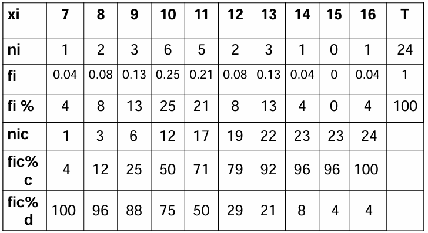
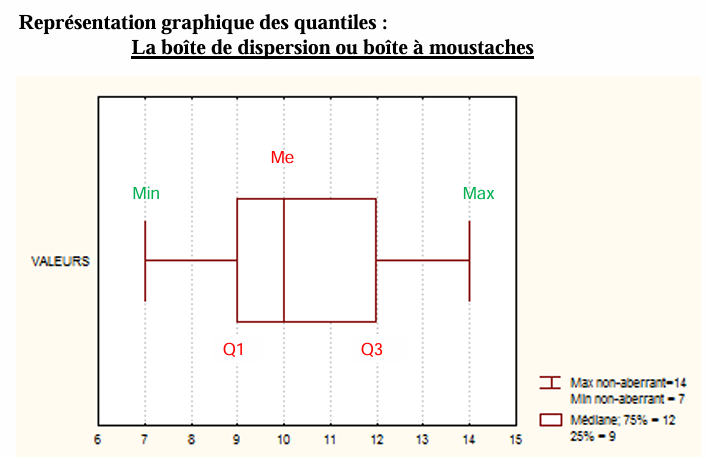
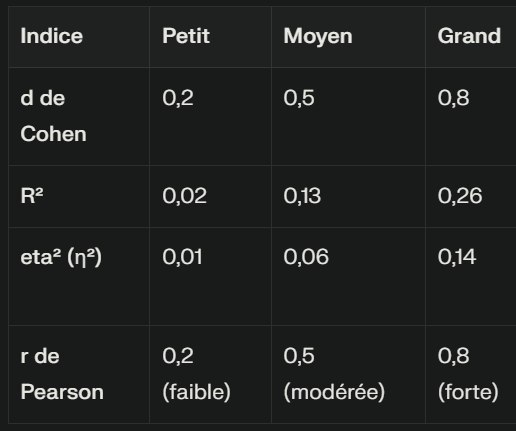

# Stats descriptives
Permet de décrire les données recueillies.
## Population, échantillonnage
Population : C'est l'ensemble de référence. 
	C'est également l'ensemble concerné par les conclusions que l'on souhaite tirer des observations. Le plus souvent, le psychologue n'a pas accès à l'ensemble de la population qu'il étudie.
Echantillon : C'est un sous-ensemble de la population, sur lequel sont faites les observations.
	La notion d'échantillon pose deux problèmes : 
	* construction d'un échantillon représentatif (la représentativité)
	* passage de l'échantillon à la population (la généralisation ou inférence).

## Variabilité
Variable : C'est un aspect particulier de l'individu auquel on s'intéresse.
	ex. : son âge, son métier, sa performance à un test verbal …

Modalités ou valeurs : Ce sont les différents "états" que l'on trouve associés à une variable.
	ex. : la variable sexe possède deux modalités, masculin et féminin ou hommes et femmes.

### Les variables qualitatives
#### Nominales
Comme leur nom l'indique, les modalités de ces variables sont des noms. On ne peut que faire la liste des modalités, il n'y a pas d'ordre pour les modalités, on ne peut pas faire de calcul sur les modalités. 
	ex. : la variable sexe avec les hommes et les femmes ; la variable couleur des yeux avec les modalités bleus, verts, marrons, …
#### Ordinales
Les modalités sont des noms et on peut ordonner ces modalités.
	Exemples : 
	* la taille américaine des vêtements : petit (Small), moyen (Medium), grand (Large) 
	* certaines évaluations individuelles : Pensez-vous que l'actuel premier ministre est capable de faire progresser l'économie française : - pas du tout capable - moyennement capable - tout à fait capable.
### Les variables quantitatives
#### Discrètes
Ces variables sont aussi appelées variables quantitatives discontinues. Les valeurs mesurées sont isolées les unes des autres. 
	Exemples : 
	* le nombre d'enfants dans une famille (pas 2.5 enfant mais 2 ou 3) 
	* le nombre de mot dans un texte 
	* la puissance fiscale d'une voiture
#### Continues
Les valeurs peuvent être quelconques à l'intérieur d'un intervalle défini. 
Les limites de cet intervalle sont le minimum et le maximum de la variable. 
	Exemples : 
	* taille 
	* vitesse de course

## Exemple sur Jamovi

📊 [Télécharger le fichier Jamovi (.omv)](https://raw.githubusercontent.com/thomas-psy/stats-psychologie/main/Files/Exemple_dummies.omv)

## Description d'une variable
### Indice de tendance central
#### Moyenne
C'est la somme des valeurs observées, divisée par le nombre d'observations.
#### Médiane et mode
##### Tableau d'effectif et fréquence

##### Mode
On utilise le mode pour les variables qualitatives nominales.
Il s'agit de la modalité la plus répondu par l'échantillon. 
	Dans notre exemple, le 10 (avec 6 réponses soit 25% des réponses totales)
##### Médiane
On utilise la médiane pour les variables qualitatives ordinales.
Il s'agit de la modalité répondu par l'individu central lorsqu'il sont ordonnés par réponse. On utilise la formule (Effectif total+1)/2
	Dans notre exemple, il y a 24 individus, (24+1)/2 ce sera donc la 12,5ème réponse (donc la 13ème) soit 11.
### Indice de dispersion
#### Ecart-type (Standard deviation -SD)
C'est l'indice de dispersion le plus utilisé. Il découle de la Variance (SD²). Il l'a l'avantage par rapport à la variance de s'exprimer dans la même unité que la variable.
	Ex : Pour une variable âge, la valeur de la variance sera en année² (ce qui n'a aucun sens) alors que l'écart type sera en année.
#### Quantilage
Quantiler c'est découper une distribution ordonnée en tranches de mêmes effectifs.
La formule est rang Qr = r(N+1)/p 
	(r = numéro du quantile ; p = nombre de tranches)
	Avec notre exemple, Q1 = 1*(24+1)/4 soit 6,25 donc le 1er quartile correspond à la modalité répondue par le 7ème sujet : 10.
	Avec notre exemple, Q2 = 2*(24+1)/4 soit 12,5 donc le 2ème quartile correspond à la modalité répondue par le 13ème sujet : 11.
	Avec notre exemple, Q3 = 3*(24+1)/4 soit 18,75 donc le 3ème quartile correspond à la modalité répondue par le 19ème sujet : 12.

Les quantilages classiques : 
* Quartilage : On découpe la distribution en 4 tranches ce qui détermine donc 3 quartiles Q1, Q2 et Q3 (Q2 correspond à la médiane). 
* Décilage : On découpe la distribution en 10 tranches ce qui détermine donc 9 déciles, D1, D2, D3, D4, D5, D6, D7, D8 et D9 (D5 correspond à la médiane). 
* Centilage : On découpe la distribution en 100 tranches ce qui détermine donc 99 centiles, de C1 à C99 (C50 correspond à la médiane).

 
# Stats inférentielles
Permet d'inférer les caractéristiques d'un ensemble plus large à partir d'un ensemble restreint.
## p-value et taille d'effet
La P-value est la valeur probable de rejeter l'hypothèse H0. Concrètement, si la p-value est inférieur ou égale à 0,05 (attention aux arrondis), ça veut dire que les caractéristiques de mon échantillon sont généralisables à ma population de référence (à supposer que mon échantillon soit représentatif).
	En théorie, la p-value est un seuil de significativité ce qui veut dire qu'une p-value de 0,04 n'est pas moins significative qu'une p-value de 0,001.
	Il faut savoir que la p-value est sensible à la taille d'échantillon, ce qui veut dire qu'elle aura très peu de probabilité d'être faible lorsqu'on a un tout petit échantillon mais également qu'elle sera très certainement significative lorsque l'échantillon est très grand (cf. corrélation aléatoire).

La taille d'effet est un indicateur de la force d'un effet observé. Il ne fonctionne pas de manière binaire comme la p-value. Ainsi, un effet significatif peut être très fort comme très faible. Il existe plusieurs indicateurs de taille d'effet.
En psycho à Nantes, on nous enseigne principalement : 
* le d de cohen 
	Il se calcule en plus du test réalisé et va souvent avec un t-test.
* le R de bravais-pearson
	Il correspond au coefficient de corrélation obtenu lors du test de bravais-pearson
* le n² (éta²)
	Il se calcule en plus du test réalisé et va souvent avec une Anova
* le R² 
	Il se calcule en plus du test réalisé et va souvent avec une régression linéaire simple

Chacun de ces indicateurs possède ses propres standards d'interprétation.

Pour le r de Pearson : on parle souvent de très faible (<0,2), faible (0,2-0,4), modérée (0,4-0,6), forte (0,6-0,8), très forte (≥0,8).
## Arbre de décision et choix de test

### Paramétrique vs non paramétrique
L'emploi de test paramétrique ou non paramétrique se décide selon le degrés de normalité de la distribution des résultats. Il n'y a pas de standards pour prendre cette décision (hormis Shapiro-wilk mais vraiment pas idéal). Fondamentalement, un test paramétrique est plus précis qu'un non paramétrique, lorsque les 2 sont possibles, il vaut mieux utiliser du paramétrique.
Pour déterminer la normalité, on peut :
* utiliser Skewness et Kurtosis
	* Kurtosis : -2 et +2
	* Skewness : -1 et +1
* faire une représentation graphique des données

Erceg-Hurn, D. M., & Mirosevich, V. (2008). Modern robust statistical methods: an easy way to maximize the accuracy and power of your research. American Psychologist, 63(7), 591-601. doi: 10.1037/0003-066X.63.7.591

Cet article explique que les tests paramétriques classiques peuvent produire des résultats erronés si leurs hypothèses (dont la norma lité) sont violées, mais qu'ils restent très robustes dans la plupart des cas pratiques, notamment lorsque la taille d'échantillon est suffisante et que les violations ne sont pas extrêmes. Les auteurs encouragent néanmoins l’utilisation occasionnelle de méthodes robustes ou non paramétriques quand la situation l’exige (données très asymétriques, petites tailles de groupe, etc.), mais confirment que dans la majorité des cas rencontrés en psychologie, les tests paramétriques restent appropriés.
### Exemple Jamovi
Petit rappel Jamovi :
* Une colonne = une variable
* Il faut bien catégoriser notre variable 
 
 

#### T Student
Permet de tester une différence de résultat quantitatif en fonction de 2 groupes. Utilisable pour des échantillons appariés et indépendants (Attention à bien sélectionner notre cas dans Jamovi).
#### Corrélation bravais-pearson
Permet de tester un lien entre 2 séries de résultats quantitatifs.
#### Chi²
Permet de tester une différence de résultats qualitatifs. Concrètement, la répartition des données est elle cohérente avec un tirage aléatoire ou y a t'il une tendance qui influence la répartition ?
#### ANOVA
Permet de tester un lien entre une variable quantitative et une (à + de 2 modalités) ou plusieurs variables qualitatives.
La logique de l'ANOVA est la suivante : 
* Observation d'une variance totale
* Décomposition de la variance en substrat inter et intra individu.
* Décomposition des substrats en fonction des variables prévues par le modèle + résidus
* Interprétation des résultats obtenus
#### Régression linéaire
Permet de tester un lien entre 2 ou + variable quantitative. Dans le cas d'un lien entre 2 variables, fonctionne différemment de la corrélation. Permet de tester un sens dans l'association. Tel facteur impact tel résultat (ce qui n'est pas le cas de la corrélation)

La logique de la régression est la suivante : 
* Observation d'une variance totale
* Décomposition de la variance en substrat inter et intra individu.
* Décomposition des substrats en fonction des variables prévues par le modèle + résidus
* Interprétation des résultats obtenus
## Analyse de puissance
Une analyse de puissance est réalisée pour garantir la fiabilité et la validité des résultats d'une étude statistique ou expérimentale. 
Elle permet d’évaluer la capacité d’un test à détecter un effet réel lorsqu’il existe, ce qui est essentiel pour éviter de conclure à tort qu’il n’y a pas d’effet (faux négatif - erreur de type II).

Les risques principaux encourus dans le cas d'étude sous-puissante sont (Vankelecom et al., 2025) :

- Une probabilité élevée d'erreur de type II, c’est-à-dire de ne pas détecter un effet réel (faux négatif), ce qui diminue la capacité de l'étude à trouver un effet lorsqu'il existe.
    
- Un gaspillage des ressources (temps, énergie, argent) car une étude sous-puissante détecte moins bien les effets et peut induire à refaire des recherches inutiles.
    
- Une tendance accrue à l'emploi de pratiques de recherche douteuses (QRPs) comme le p-hacking, où le chercheur manipule les analyses pour obtenir des résultats significatifs malgré un design sous-puissant.
    
- Une surreprésentation des effets surévalués dans la littérature scientifique due au biais de publication avec uniquement des résultats significatifs publiés, phénomène connu sous le nom de "winner’s curse".
    
- Une diminution de la précision prédictive des résultats, avec une baisse de la valeur prédictive positive et négative des tests statistiques, réduisant la fiabilité des décisions statistiques tirées.
### Utilisation de Gpower

# Utiliser un test sur 1 individu
## Loi normale et exemple du QI
## Z score et comparaison à la population de référence

